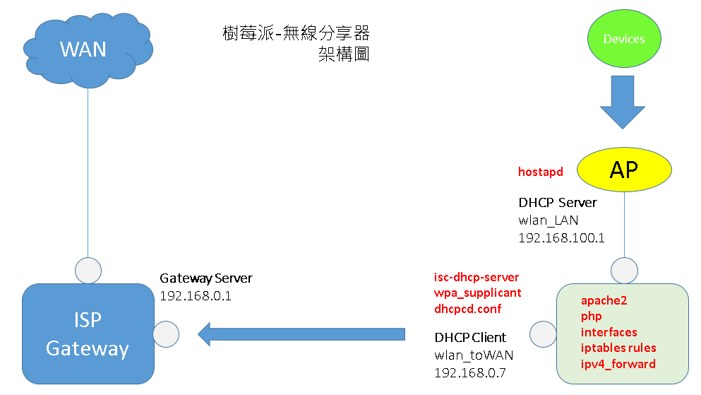
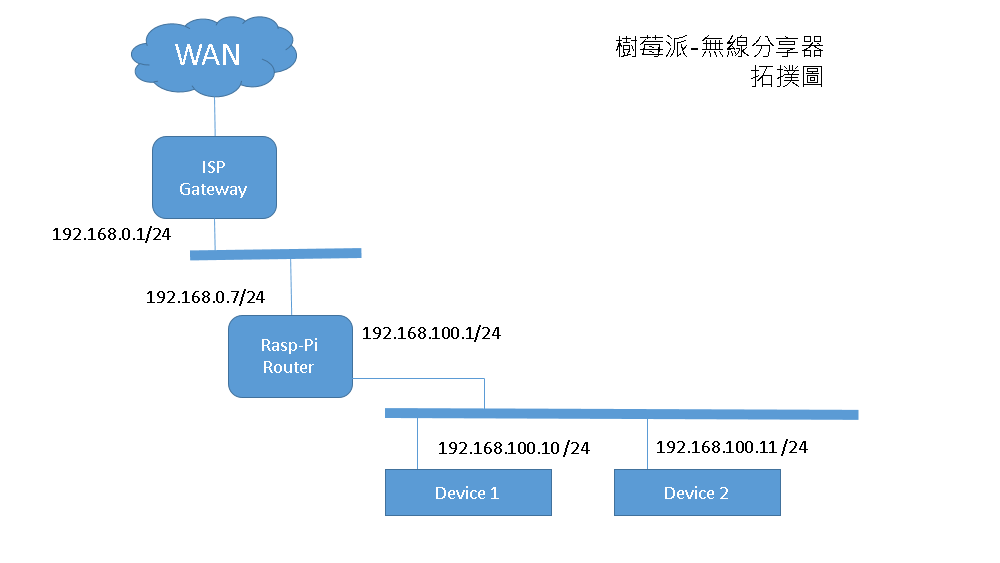

# 樹莓派 RPI router 專題


## 前置準備硬體、軟體、配件

為了做一個 有 AP 功能的無線 IP 分享器，需要以下設備來開發

Raspberry Pi 3 model B

micro SD 8G 以上 (class 10)

USB 鍵盤

HDMI 螢幕

電腦

電源

wifi USB adapter (dongle)

當樹莓派安裝好作業系統，可以透過三種方式連到 target board 上面

#### 第一種方法

需要用到 HDMI 螢幕跟 USB 鍵盤

安裝完 raspbian 作業系統之後，開啟 config.txt，
把 hdmi_force_hotplug=1 前面的 # 去掉
```
hdmi_force_hotplug=1
```
接著啟動 board 就可以使用 HDMI 螢幕來 output
使用 USB 鍵盤( 樹莓派不支援 PS2/USB 鍵盤 ) 來 input


#### 第二種方法

安裝完 raspbian 作業系統之後，新增一個 ssh 的空白檔案到記憶卡中來開啟 ssh 功能，

接著把 board 用 RJ45 接頭接上跟電腦同一個 LAN 網段 (這邊是接上有 DHCP server 功能的 ISP gateway)，

樹莓派會預設開啟 RJ45 接頭的 ethernet 介面，樹莓派會拿到 private IP，

接著就可以從電腦連到 ISP，利用同一個區網的關係，再用 ssh (teraterm , putty) 連到樹莓派


#### 第三種方法
使用 USB to TTL Serial Cable

..... QQ


## Configuration

* 安裝

下載 raspbian 無 X window 版本

[https://www.raspberrypi.org/](https://www.raspberrypi.org/)

```
RASPBIAN STRETCH LITE
Minimal image based on Debian Stretch
Version:September 2017
Release date:2017-09-07
Kernel version:4.9
Release notes:Link
SHA-256:bd2c04b94154c9804cc1f3069d15e984c927b750056dd86b9d86a0ad4be97f12
```

另外再下載 hash 比對器，確定檔案來源

[install guide](https://www.raspberrypi.org/documentation/installation/installing-images/README.md)

另外再去下載 SD card formatter 跟燒映像檔的 Etcher

格式化記憶卡再燒錄映像檔，完成之後開啟記憶卡，

開啟 config.txt，

uncomment 
```
hdmi_force_hotplug=1
```

另外再加入一個空白的檔案，檔名叫 ssh，用來開啟 ssh 功能


* 外接 USB wifi dongle

因為這個專題是想要做有 AP 功能的無線 IP 分享器，所以 board 需要有兩個無線 802.11 模組，

樹莓派內建了一個，還需要一個無線網路介面這邊買了 Edimax EW7811un，有支援 raspbian 作業系統隨插即用 

把安裝好 rasibian 作業系統的記憶卡跟 USB wifi dongle 裝到樹莓派上面之後開機，

有 RJ 45 網路線的話，可以直接接上，會自動啟動 eth0 介面，拿到 DHCP server offer 的 IP，

先更新系統，再安裝軟體

```
sudo apt-get update;
sudo apt-get upgrade -y;
sudo apt-get install vim vim-snippets vim-runtime apache2 php hostapd isc-dhcp-server -y;
sudo reboot;
```

再來是確定系統有沒有抓到外加的 dongle (USB WIFI device)
```
/*可以看到有沒有 USB 有沒有抓到設備資訊*/
lsusb

/*確定交叉比對網路介面*/
/*ifconfig -a 應該可以看到 4 個 interfaces，一個有線 ethernet，兩個無線 ethernet，一個 loop */

ifconfig -a
iwconfig


/*交叉比對出介面跟 MAC 之後，就是來更改並且固定介面的名稱*/
/*因為如果使用系統預設的介面名稱，兩個無線的 wlan* 名稱很有可能會跳來跳去，這樣會對後期設定造成問題 */

路徑
/etc/udev/rules.d/

新增一個新的檔案，取名為
70-persistent-net.rules


code 內容
SUBSYSTEM=="net", ACTION=="add", DRIVERS=="?*", ATTR{address}=="aa:bb:cc:dd:ee:ff", ATTR{dev_id}=="0x0", ATTR{type}=="1", NAME="The_name_you_want"

設定完
reboot
```


* 進一步設定網路介面

這個專題我們需要兩個無線網路介面
內建的我們取名為 wlan_LAN
外接的我們取名為品牌名字 wlan_toWAN

先設定全部的 interfaces
```
路徑
/etc/network/interfaces


/*設定 localhost*/
auto lo
iface lo inet loopback


/*設定 rj45 ethernet 支援熱插拔跟設定成 dhcp*/
allow-hotplug eth_built_in
iface eth_built_in inet dhcp


/*設定 wireless ethernet 支援熱插拔跟設定成 static*/
/*設定 子網路 192.168.100.0*/
allow-hotplug wlan_LAN
iface wlan_LAN inet static
address 192.168.100.1
netmask 255.255.255.0
broadcast 192.168.100.255


/*設定 wireless ethernet 支援熱插拔跟設定成 dhcp*/
allow-hotplug wlan_toWAN
iface wlan_toWAN inet dhcp
wpa-conf /etc/wpa_supplicant/wpa_supplicant.conf
/*wpa_supplicant.conf 是 scan AP SSID 並連接的帳密設定檔案*/

```

* 設定 wpa_supplicant.conf

```
wpa_supplicant.conf 這個檔案是給 wireless interface 連接到特定網路的設定檔

有兩種方式做基本設定

第一種
在 wpa_supplicant.conf 裡面直接設定

network={
	ssid="network_SSID"
	psk="network_password"
}

第二種
在 bash 直接輸入 wpa_passphrase <SSID> <password>
就會直接輸出 hash 過的帳密，這段 code 貼到 wpa_supplicant.conf
這樣就可以了

另外可以加上一些 parameter
可以參考下面的 wpa_supplicant.conf 連結

設定完成後 reboot

```

[wpa_supplicant.conf](https://w1.fi/cgit/hostap/plain/wpa_supplicant/wpa_supplicant.conf)


reboot 之後，看 ifconfig 應該就可以看到 interfaces 都設定好了

wlan_toWAN 也可以拿到 private IP

接下來就是用 hostapd 把 wlan_LAN 設定成 AP

* Hostapd 設定 wlan_LAN 為 SoftAP

[參考 hostapd.conf](https://w1.fi/cgit/hostap/plain/hostapd/hostapd.conf)

```
路徑
/etc/hostapd/

新增檔案
hostapd.conf

code 內容

interface=wlan_LAN
ssid=RPIrouter
wpa_passphrase=raspberryPI
ignore_broadcast_ssid=0
hw_mode=g
channel=5
macaddr_acl=0
auth_algs=1
wmm_enabled=1
wpa=2
wpa_key_mgmt=WPA-PSK
rsn_pairwise=CCMP


/*附註*/

//要當 SoftAP 的網路介面
interface=wlan_LAN			

//SSID
ssid=RPIrouter

//password
wpa_passphrase=raspberryPI

//SSID 廣播的種類 
//0:廣播 
//1:把 SSID 設定成 empty(無法掃描連接) 
//2:隱藏 SSID(可以掃描連接) 
ignore_broadcast_ssid=0

hw_mode=g
channel=5
macaddr_acl=0
auth_algs=1
wmm_enabled=1
wpa=2
wpa_key_mgmt=WPA-PSK
rsn_pairwise=CCMP


完成之後，可以測試
sudo hostapd /etc/hostapd/hostapd.conf

如果成功，就把 hostapd.conf 設定給 hostapd daemon

路徑
/etc/default/hostapd

uncomment 並設定 hostapd.conf 路徑
DAEMON_CONF="/etc/hostapd/hostapd.conf"

這樣 hostapd daemon 才知道去哪裡找 config 檔來運行 hostapd

```
* Wireless 無線模組的 power_save management mode

```
輸入
iw 
可以看到很多有相關的指令，其中

iw dev wlan_LAN info 
可以看到 wlan_LAN 介面的資訊

iwconfig wlan_LAN 
可以看到 wlan_LAN 的 power management on 這個資訊

依照這個專題的需求，我們想要把這個省電模式關閉


因為如果 wlan_LAN 內建無線網路模組的電源管理運行在省電模式，
可能會在待機一段時間之後，就停止網路連接，造成服務不穩定，

這對於 AP router 來說，不是必要的功能，因此把 wifi 省電模式關閉

手動關閉的方法是
sudo iw dev wlan_LAN set power_save off

但是每次系統 reboot 之後，設定就會 reset，
因此進入 rc.local 檔案，
設定成每次開機 boot up 的時候就會執行 power management off

路徑
/etc/rc.local

在 exit 0 之前加上這段 code

sudo iw dev wlan_LAN set power_save off

```

* DHCP server

```

接下來我們想要 configure sysctl，
讓 isc-dhcp-server 可以 serve wlan_LAN 介面，並 response private IP 給 request 的 dhcp clients


要做的部分有

設定 /etc/sysctl.conf
設定 /proc/sys/net/ipv4/ip_forward
設定 /etc/dhcp/dhcpd.conf
設定 /etc/default/isc-dhcp-server
設定 iptables rules
```

* sysctl.conf

```
設定 /etc/sysctl.conf

uncomment 這行 code
net.ipv4.ip_forward=1
```

* /proc/sys/net/ipv4/ip_forward

```
設定 /proc/sys/net/ipv4/ip_forward

ip_foward 檔案無法用 sudo vim 來編輯內容，所以只能在 bash 上輸入指令，
使用 std output 的方式寫到檔案裡面

sudo bash -c "echo 1 > ip_forward"

ip_forward 檔案的內容原本是只有 0
後來我們把內容改成 1

```

* /etc/dhcp/dhcpd.conf

```
設定 /etc/dhcp/dhcpd.conf
這個部分我們要設定 dhcp server，讓連進來的 dhcp client device 可以 get offered IP，

首先加上這段 code
db-time-format local;

這是為了調整 dhcp server 的 time stamp，把原本的 UTC 時區設定成本地端，
也就是依照設備安裝的 timezone 的時區設定，
這對於 dhcp server 所提供的 IP lease 的時間長短沒有影響，
但是會影響，lease 何時發出，何時到期的時間資訊

再來是設定子網路區段

我們想要設定一個子網路區段為 192.168.100.0
AP 的介面 static IP 為 192.168.100.1
這個區段的廣播位址是 192.168.100.255
子網路遮罩是 255.255.255.0
原本可以分配的 host number 是 192.168.100.2 ~ 192.168.100.254
我們縮減成 192.168.100.2 ~ 192.168.100.10 可以分配 10 個 host number

subnet 192.168.100.0 netmask 255.255.255.0 {
	range 192.168.100.2 192.168.100.10;

	option domain-name-servers 8.8.8.8;
	option routers 192.168.100.1;
	option broadcast-address 192.168.100.255;

	default-lease-tim 600;
	max-lease-time 720;
}

```

LAN 端的拓撲跟架構應該是這樣






* /etc/default/isc-dhcp-server

```
在 INTERFACESv4 的選項中加入要 serve 的介面
INTERFACESv4="waln_built_in"

```

* iptables rules

```
iptables 相關指令

iptables 主要是設定 datagram 在介面與介面之間的行為
也可以設定 NAT 讓子網路上的眾多設備可以透過 iptable 來達成，
多個 private IP 經由一個 public IP 跟 WAN 端溝通

設定相關指令
iptables

輸出設定好的規則變成一個 iptables rules file
iptables-save > table_rules 

輸入設定好的 iptables rules file
iptables-restore < table_rules


輸入 iptables rule code

sudo iptables -t filter -A FORWARD -i wlan_toWAN -o wlan_LAN -m state --state RELATED,ESTABLISHED -j ACCEPT

sudo iptables -t filter -A FORWARD -i wlan_LAN -o wlan_toWAN -j ACCEPT

sudo iptables -t nat -A POSTROUTING -o wlan_toWAN -j MASQUERADE

輸入 iptables rule 完成之後
可以用 iptables -S 檢視一下規則

再來用把規則輸出成一個 rule config 檔
sudo iptables-save > iptable_rules

然後把這個 rule config 檔，用 std input 的方式，來啟動規則
sudo iptables-restore < iptable_rules

```

* 最後測試及設定

```
sudo service hostapd start
sudo service isc-dhcp-server start

sudo service hostapd restart
sudo service isc-dhcp-server restart

service hostapd status
service isc-dhcp-server status

如果運行狀態都 OK，皆顯示 enable 及 active (running)
那就把這兩個 service 設定為開機預設啟動

sudo update-rc.d hostapd enable
sudo update-rc.d isc-dhcp-server enable

```
* 開機載入 iptables

```
所有設定都完成後，最後要設定開機載入 iptables，
因為我們之前手動載入的 iptables rules 會因為 reboot 之後而失效，
所以我們設定成開機在 boot up 的階段會自動載入 iptables

路徑
-----
/etc/rc.local
在 exit 0 之前加入這段 code

sudo iptables-restore < 你的 iptables rule file 路徑

sudo reboot 完成
```

[hostapd](https://w1.fi/hostapd/)

[wpa_supplicant](https://w1.fi/wpa_supplicant/)

[isc-dhcp-server](https://kb.isc.org/article/AA-00333)

[db-time-format](https://forum.pfsense.org/index.php?topic=73210.0)

[iptables ref1](https://www.digitalocean.com/community/tutorials/how-to-set-up-a-firewall-using-iptables-on-ubuntu-14-04)

[iptables ref2](https://askubuntu.com/questions/91413/reloading-iptables)

[iptables ref3](https://www.upcloud.com/support/configuring-iptables-on-ubuntu-14-04/)

[iptables ref4](https://askubuntu.com/questions/119393/how-to-save-rules-of-the-iptables)

[iptables delete rules](https://www.digitalocean.com/community/tutorials/how-to-list-and-delete-iptables-firewall-rules)

[Network Interface Name Change](https://askubuntu.com/questions/767786/changing-network-interfaces-name-ubuntu-16-04)

[rc](https://unix.stackexchange.com/questions/111611/what-does-the-rc-stand-for-in-etc-rc-d)

[pi-resource](http://www.pi-resource.com/?page_id=116)

[turn-a-raspberrypi-3-into-a-wifi-router-hotspot](https://medium.com/@edoardo849/turn-a-raspberrypi-3-into-a-wifi-router-hotspot-41b03500080e)

